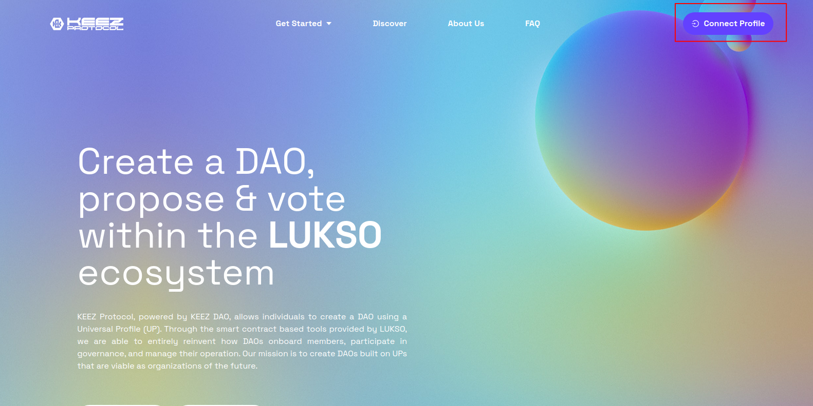
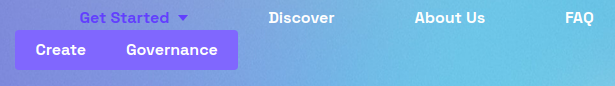

### Connect your Universal Profile to the KEEZ Protocol website.

:::info Need a Universal Profile?
If you do not have a Universal Profile, follow the [**Install the UP Browser Extension**](https://docs.lukso.tech/guides/browser-extension/install-browser-extension) guide on LUKSO's website.

:::

### Get Started

Hover over **Get Started** and choose one of the options below:

**Create** guides you through the process of creating a DAO. You will fill in details about your DAO and simultaneously create a Universal Profile for your DAO. Follow the [Create a DAO](./step-02.md) guide to proceed.

**Governance** displays the DAOs for which you have key permissions. From there, you can vote and propose in the DAO. Follow the [Governance](./step-03.md) guide to proceed.
