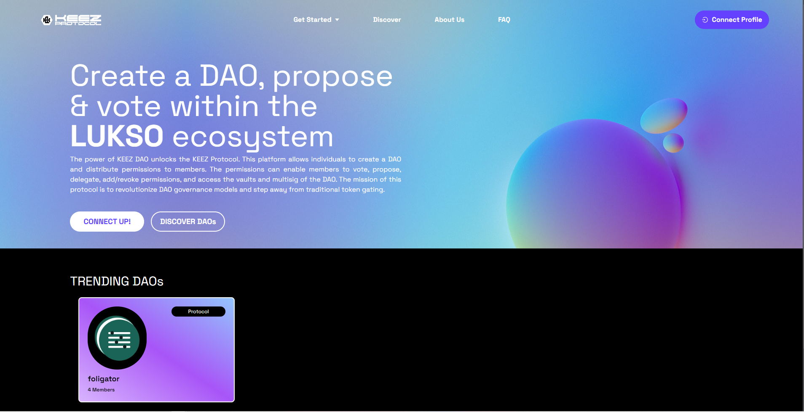

# Step 1 - Connect Universal Profile

### Step 1A: Connect your UP!
Connect your Universal Profile to the KEEZ Protocol website.
If you do not have a Universal Profile, you must first download the LUKSO browser extension and create a profile. Instructions on downloading the LUKSO browser extension and creating a Universal Profile can be found on the LUKSO docs website linked here.

### Step 1B: Select the Get Started tab
Choose one of the following:

* Create brings you to the Create a DAO page, where you will fill in details about your DAO and simultaneously create a Universal Profile for your DAO.
* Governance brings you to the DAOs that you have key permissions in. From there you can vote and propose in the DAO.

### Step 1C: Discover
Select the Discover tab to see all active DAOs on the KEEZ protocol. Here you can filter through DAOs based on various categories and join DAOs that interest you. 