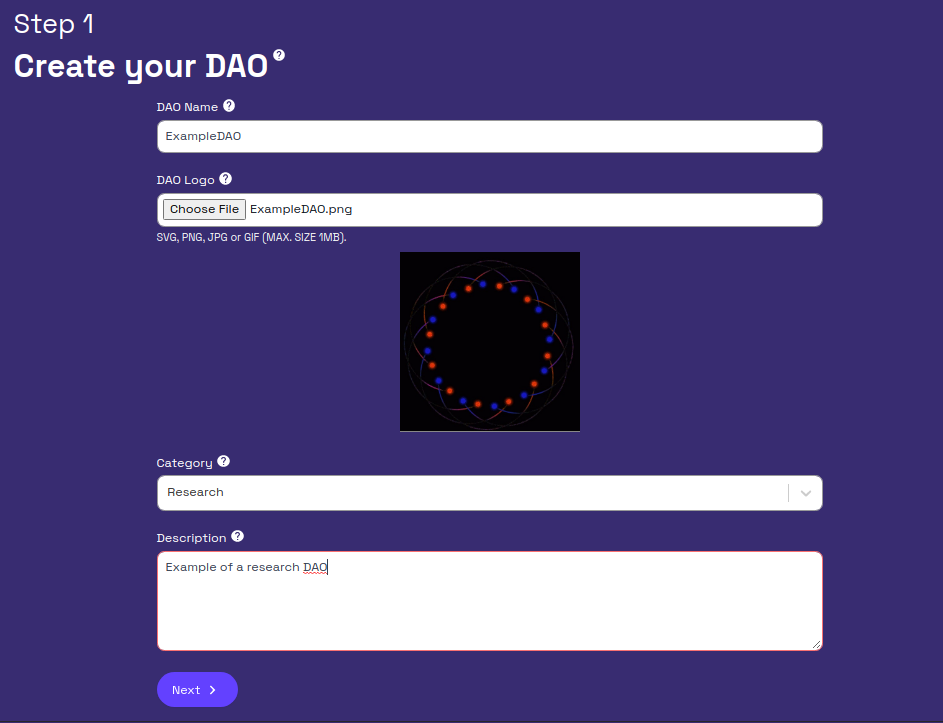
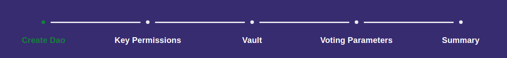
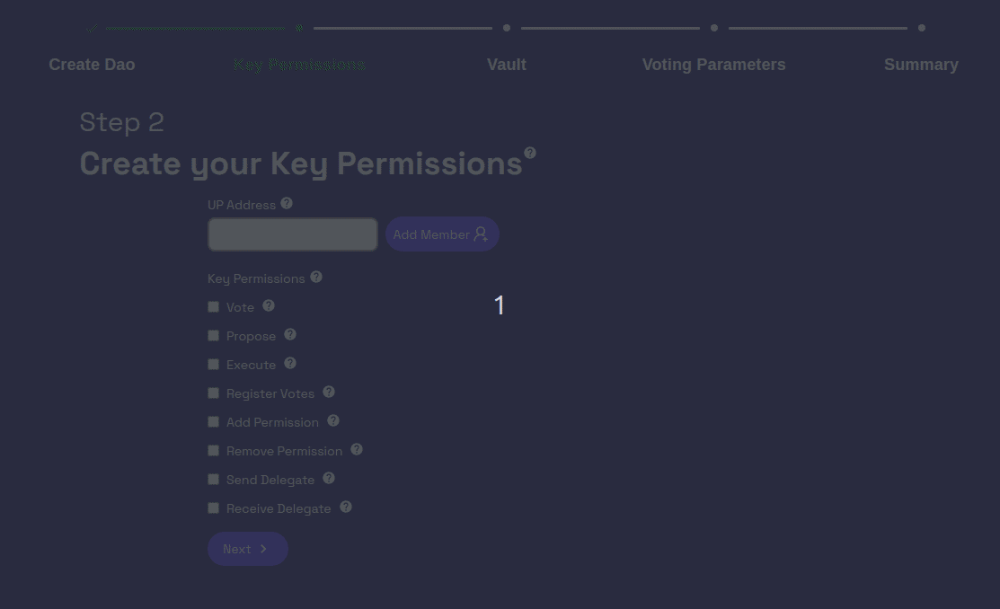
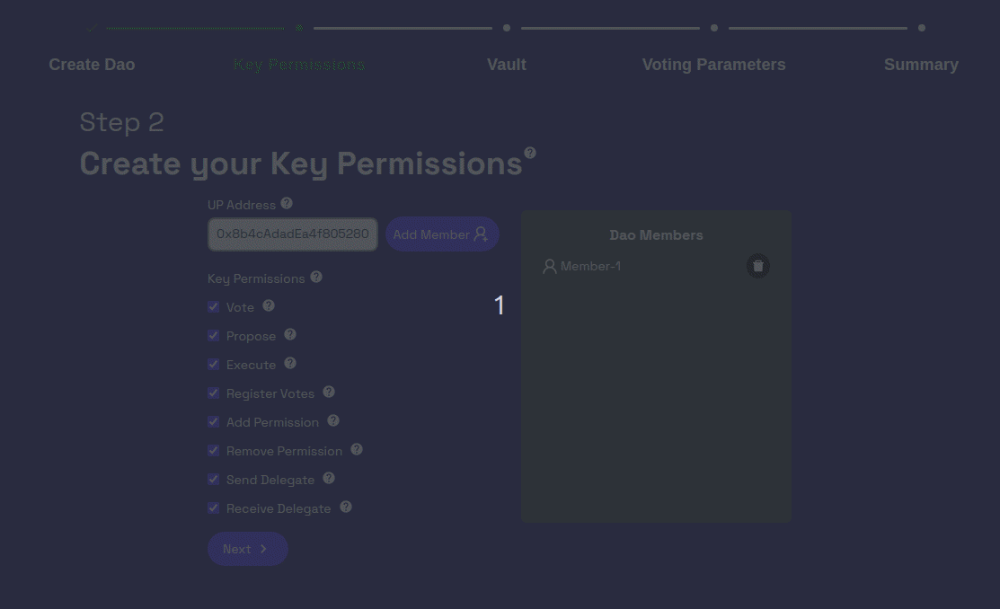
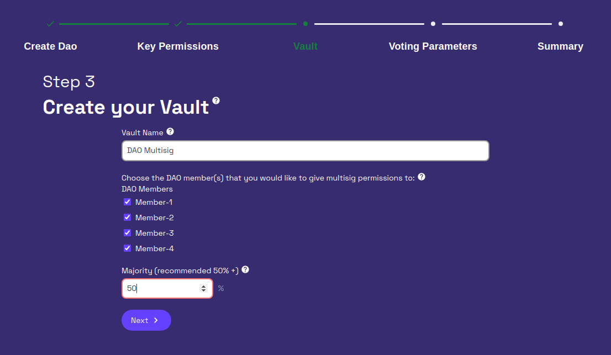
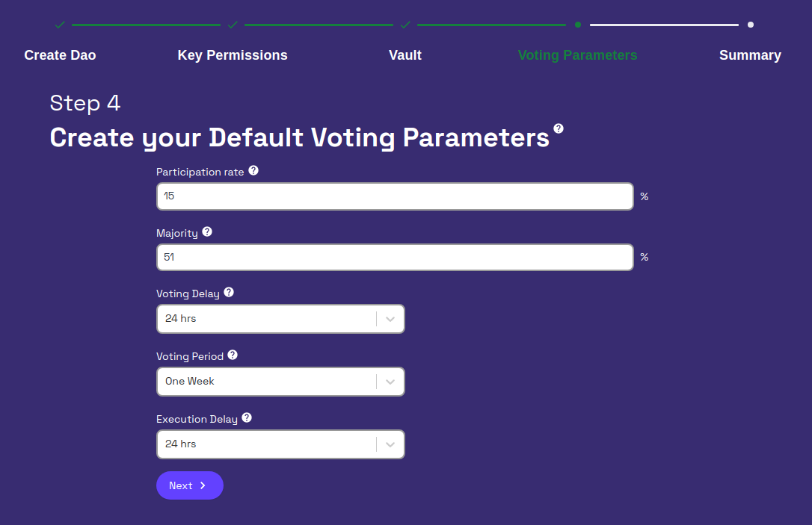
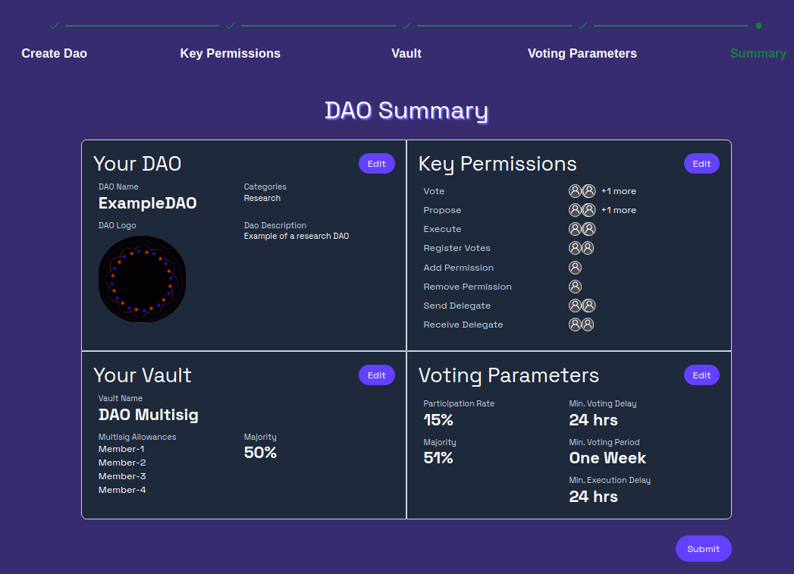
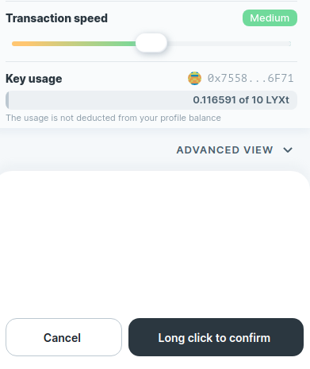

Hover over the **Get Started** tab and select **Create**.

This brings you to a new page where you can create a Universal Profile for your DAO.

---

### Step 1 - Enter Information

:::info
The information in this step is displayed on the DAO’s profile page and profile cards.
:::

:::caution
A DAO's Name and Logo can not be changed after the creation process.
:::

Enter your DAO's name, logo, category, and description. 

Click **Next** to proceed to the next step.

---
:::tip
You can click on the progress bar (below) to go back and make changes to any step.

:::

### Step 2 - Create your Key Permissions

Next, you will add members to the DAO and assign key permissions to each member.

Key permissions enable assigning roles and responsibilities to specific DAO members, a feature made possible by the innovative standards LUKSO has created.

Key Permission  |Description  |
|---------|---------|
|Vote | Allows a member to vote on proposals on the DAO profile page     |
|Propose | Allows a member to make proposals on the DAO profile page and in the governance tab       |
|Register Votes | Allows a member to register the signatures (votes) on a proposal after the voting period has ended. Votes must be registered to enable the execution of a proposal.    |
|Execute | Allows a member to push a proposal result once votes have been registered by a member with the Register Vote permission|
|Add Permission | Allows a member to assign permissions to other members         |
|Remove Permissions | Allows a member to revoke permissions from other members         |
|Send Delegate | Allow a member to delegate their vote to other members who have the Receive Delegate permission         |
|Receive Delegate   |Allows a members to vote on behalf of another member         |

:::tip
You can add as many members as you’d like with any combination of permissions. Make sure to include all members needed for the multisig. 
:::

#### 1 - Enter a member's Universal Profile address into the text box. 
#### 2 - Use the checkboxes to choose key permissions for the member being added
#### 3 - Click the <u>Add Member</u> button next to the text box to add the member.

Example of adding your first member:

#### 4 - Add additional members by clearing the Universal Profile address and checkboxes, then repeat steps 1-3 above.

Example of adding additional members:

After all your members have been added, click **Next** to proceed to the next step.

---

### Step 3 - Create Your Vault

A vault is a storage location for various assets and data. It is controlled by a multisig through multiple members' Universal Profiles. Follow the steps below to create a vault.

#### 1 - Enter a vault name (e.g., Main Vault, Dev Vault, etc.), 
#### 2 - Add members to the multisig for the UP
#### 3 - Input the percentage of multisig members needed to sign a transaction. 

Click **Next** to proceed to the next step.

---

### Step 4 - Create Your Default Voting Parameters

Next, you will decide your DAOs default voting parameters. These parameters include

- **Participation rate** - the minimum percentage of the total DAO members needed to vote on a proposal for it to be executed.
- **Majority** - the minimum percentage of votes needed on a proposal option to execute the result (i.e., if there is a 66% majority and the votes come in at 51% yes, the proposal is not passed).
- **Voting Delay** - the period in which a proposal is open for viewing but unable to be voted on. This gives a chance for the community to research the topic and have a discussion before voting.
- **Voting Period** - the period a proposal is open for voting.
- **Execution Delay** - the period after voting has ended and between when the result is executed. 

---

### Step 5 - Submit your DAO

The summary page displays the information you have input and allows you to edit any of the steps in the creation process. 

Once satisfied, use the Submit button to create your DAO Universal Profile.

When prompted by the Universal Profile browser extension, click and hold on the **Long Click to confirm** button to sign the transaction.

You can visit your DAO’s profile through the governance page, which is covered in the next step [Participate in Governance](step-03.md)
