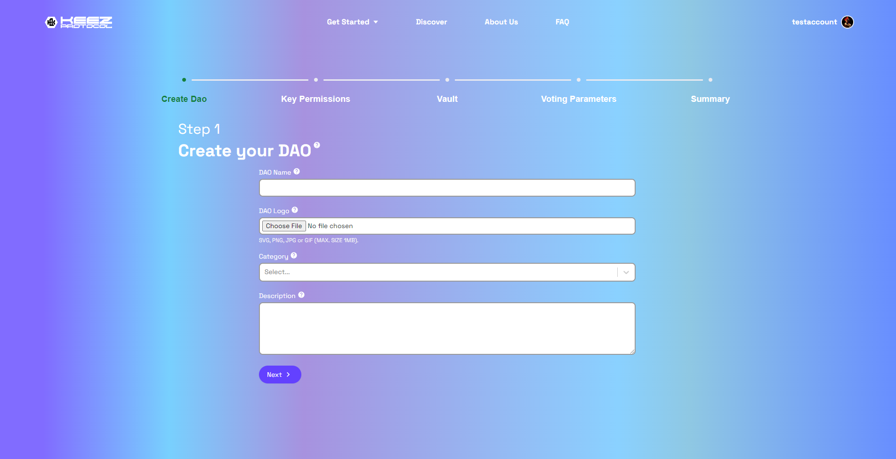
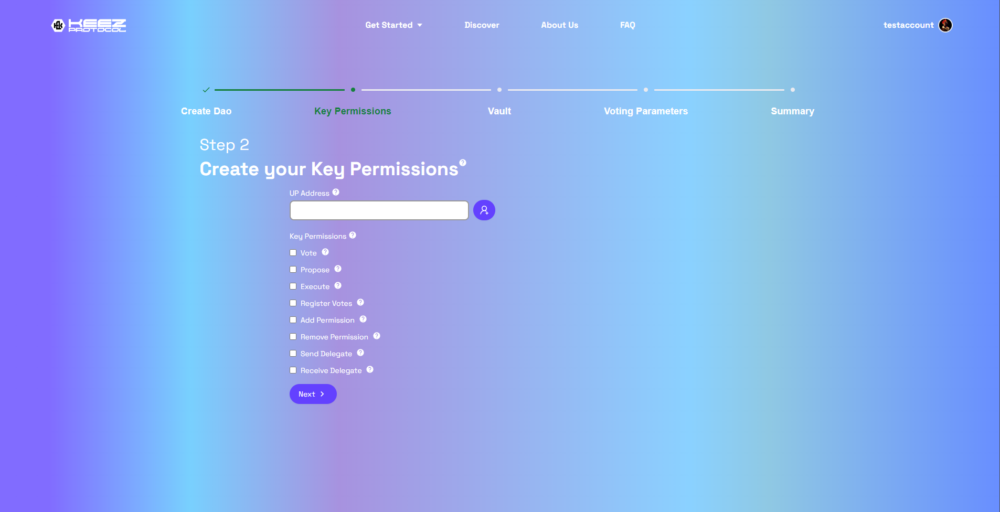
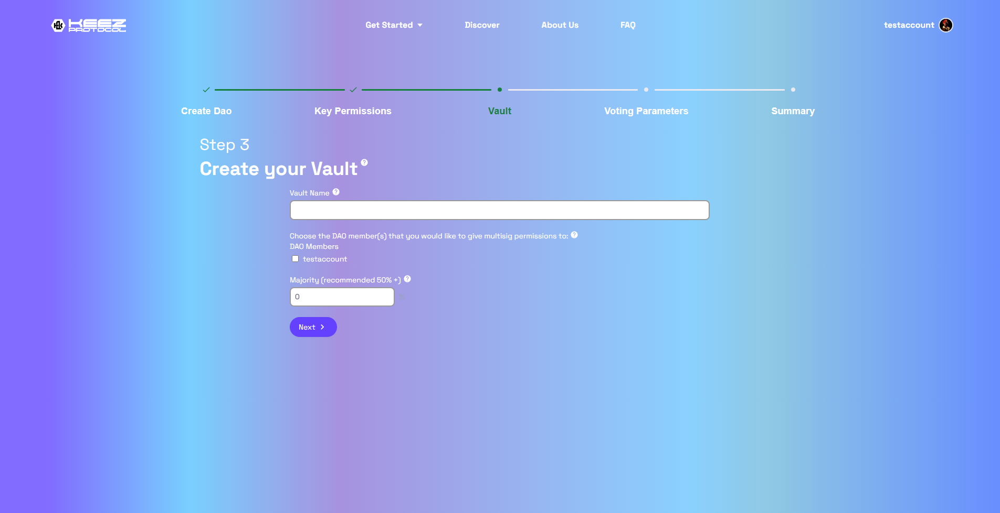
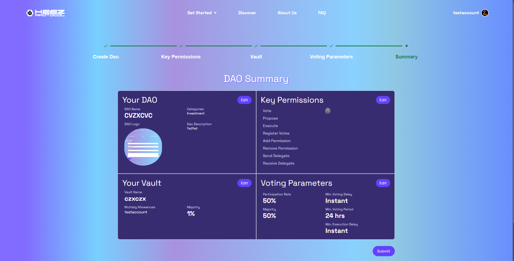

# Step 2 - Create a DAO

### Step 2A - Create A DAO

Hover over the **Get Started** tab and select **Create**.

This brings you to a new page where you can create a Universal Profile for your DAO.

---

### Step 2B - Enter Information

Here you will enter the DAO's name, logo, category, and a description. This information is displayed on the DAO’s profile page and profile cards.

Click the **Next** button to continue to the next page.

---

### Step 2C - Create your Key Permissions

Next, you will begin adding members to the DAO and assigning key permissions to each member. 

To add a member, you need to enter their Universal Profile Address into the text box. Then assign key permissions to the Universal Profile Address, 

Click the blue circular button next to the text box to add the member. You have now added the member's Universal Profile to the DAO Key Management. 

:::info
You can add as many members as you’d like with any combination of permissions. Make sure to include all members needed for the multisig. 
:::

Click the **Next** button to continue to the next page.

---

### Step 2D - Create Your Vault

The next step is to create a vault for the DAO. A vault is a storage location for various assets and data. It is controlled by multiple Universal Profiles through a multisig.

Here you will 
* Enter a vault name (e.g., Main Vault, Dev Vault, etc.), 
* Add members to the multisig for the UP
* Input the percentage of multisig members needed to sign a transaction. 

Click **Next** when you are satisfied with multisig members.

---

### Step 2E - Create Your Default Voting Parameters

Next, you will decide your DAOs default voting parameters. These parameters include

- **Participation rate** - the minimum percentage of the total DAO members needed to vote on a proposal for it to be executed.
- **Majority** - the minimum percentage of votes needed on a proposal option to execute the result (i.e., if there is a 66% majority and the votes come in at 51% yes, the proposal is not passed).
- **Voting Delay** - the period in which a proposal is open for viewing but unable to be voted on. This gives a chance for the community to research the topic and have a discussion before voting.
- **Voting Period** - the period a proposal is open for voting.
- **Execution Delay** - the period after voting has ended and between when the result is executed. 