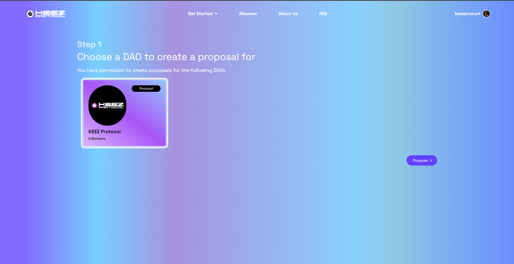
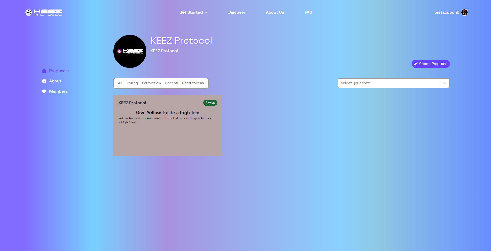
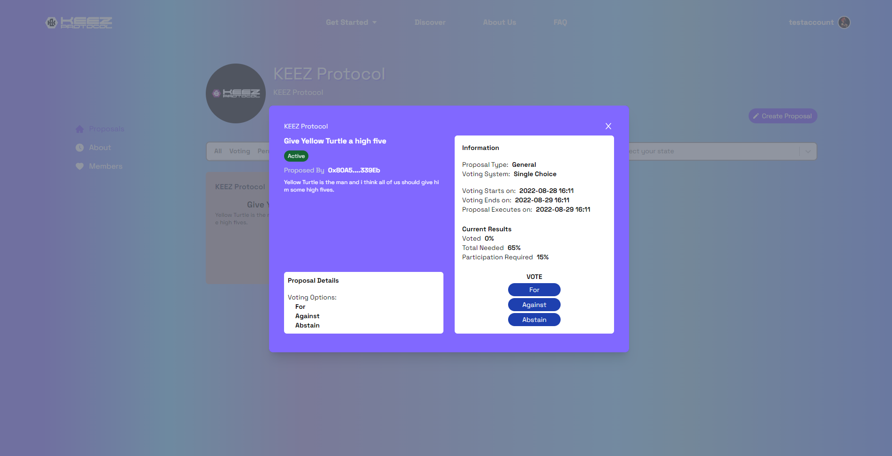

### Step 1 - Governance tab

Selecting the Governance tab will bring you to the DAOs you are a member of and allow you to use your key permissions. 

---
### Step 2 - Select a DAO

This page displays the DAOs that you have key permissions for. 

Selecting a DAO and clicking the **Propose** button will bring you to the proposal page. 

To access the DAOs profile page or vote on one of the DAOs proposals, hit the **View DAO** button on the back of the DAO's card. 

---
### Step 3 - DAO Profile Page

This is the **DAO Profile Page**, where members can vote and propose, given their key permissions.
- Members with **Vote** permissions can vote on active proposals by clicking one of the active proposal cards. 
- Members with **Propose** permissions can propose their own by clicking the Create a Proposal button. 
- Members with the **Register Votes and Execute Proposal** permissions can click into closed proposals to register and execute the results.

On the sidebar, you can explore the DAOs about section and current members.

---
### Step 4 - Vote

There are three possibilities when clicking on a proposal in an attempt to vote. 
- The proposal is pending (yellow), and members cannot vote but can view the proposal details. 
- The proposal is active (green), and members can select an option and vote. 
- The proposal is closed (red), and members cannot vote but can view the results. This is where those with execute and register permissions can finish the proposal.