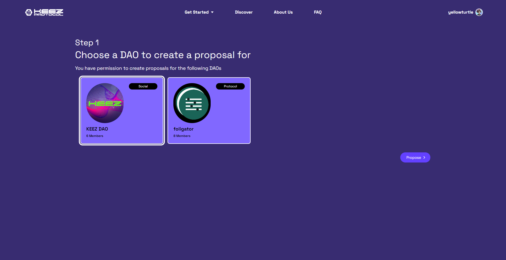
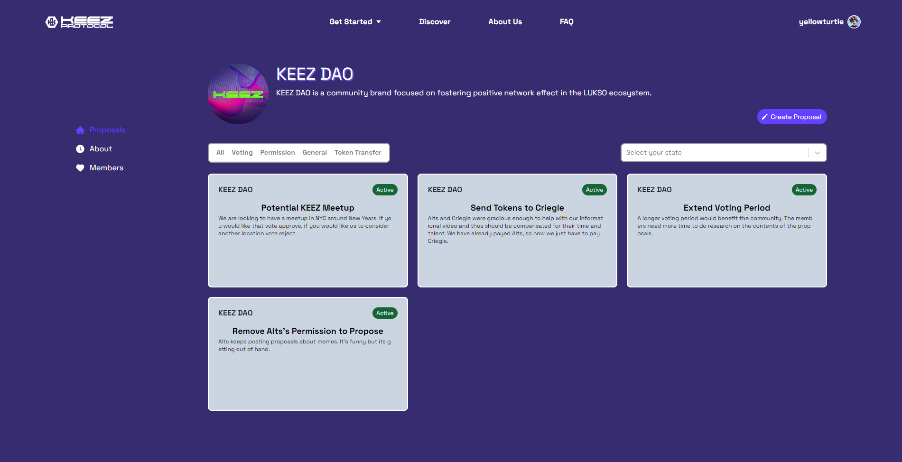
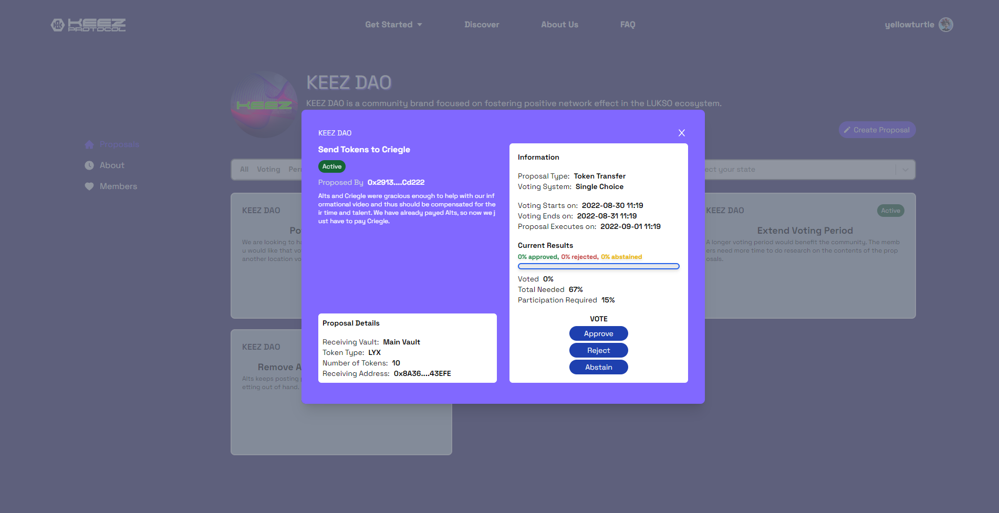
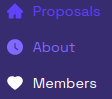

### Step 1 - Navigate to the Governance page

To view the DAOs in which you have membership and permissions for governance, select **Governance** under the **Getting Started** tab.

---
### Step 2 - Select a DAO

This page displays the DAOs in which you have been assigned permissions.

Access a DAOs profile page by clicking the **View DAO** button on the back of the DAO's card.

---
### Step 3 - DAO Profile Page

Members can vote and propose on the **DAO Profile Page** based on their key permissions.

- Members with **Vote** permissions can vote on active proposals by clicking one of the active proposal cards.
- Members with **Propose** permissions can make their own proposals by clicking the **Create a Proposal** button.
- Members with the **Register Votes** and **Execute Proposal** permissions can click on closed proposals to register and execute the results.

---
### Step 4 - Vote

The status of a proposal can be one of three possibilities:

- **Active** (green) - members can select an option and vote. 
- **Pending** (yellow) - members cannot vote but can view the proposal details. 
- **Closed** (red) - members cannot vote but can view the results, and members with execute and register permissions can finish the proposal.
 
:::tip

On the sidebar, you can explore the DAOs about section and current members.

:::