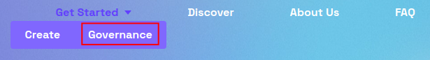
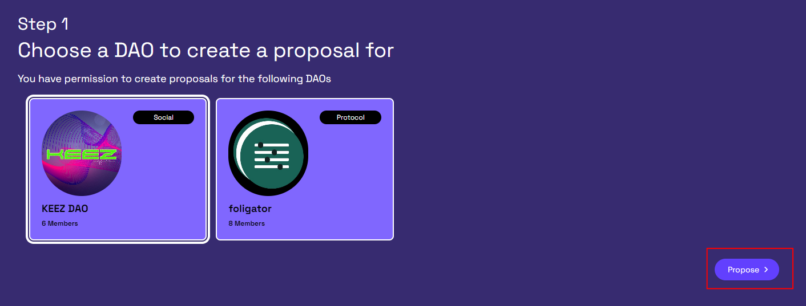
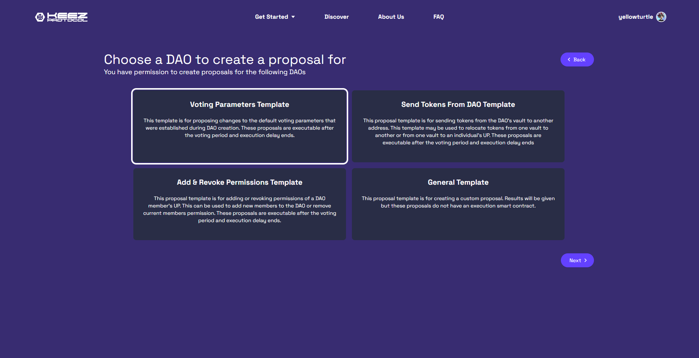
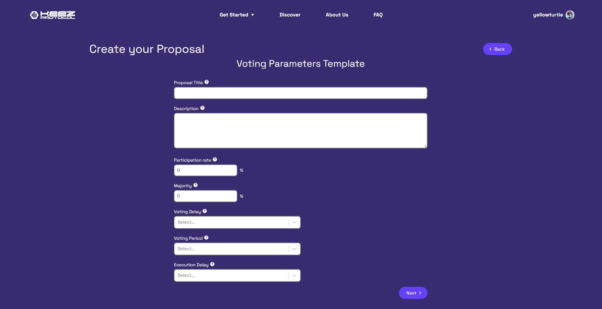
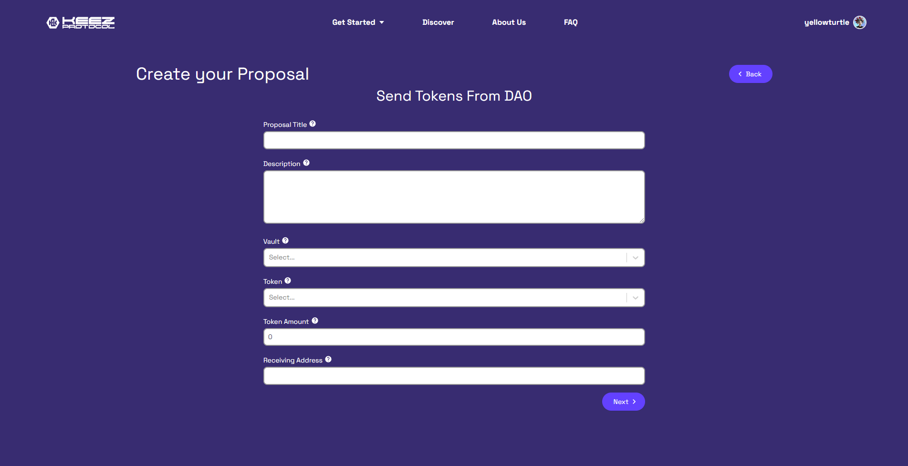
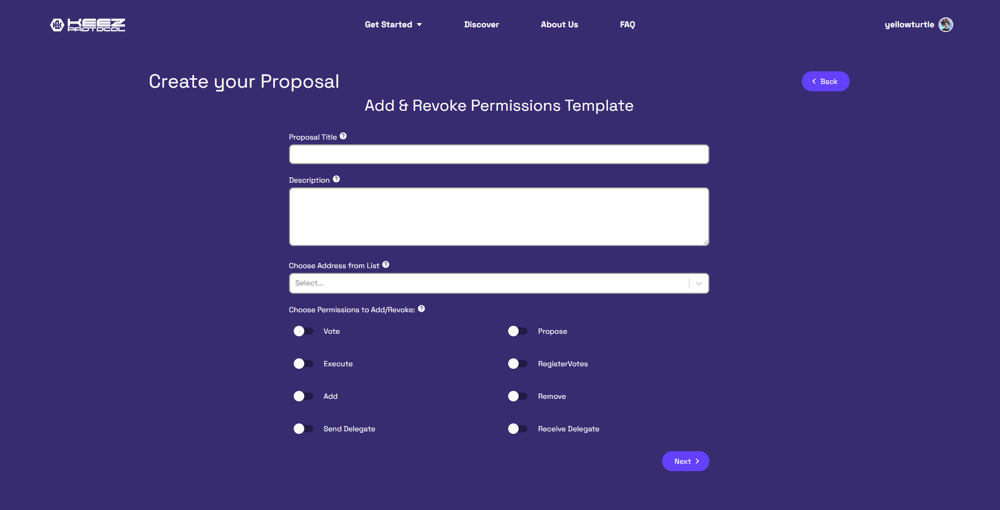
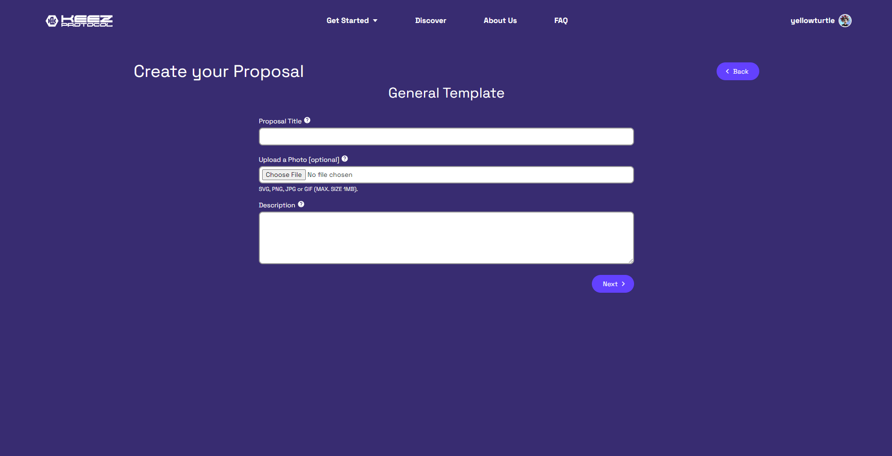
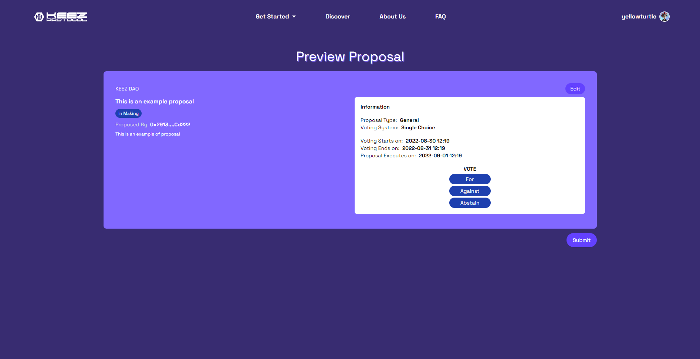

import Tabs from '@theme/Tabs';
import TabItem from '@theme/TabItem';

### Step 1 - Navigate to the Governance page

Hover over the **Getting Started** tab and click **Governance**

This page displays the DAOs that have assigned you key permissions.

Select a DAO and click the **Propose** button to create a proposal.

:::info
To create a new proposal, a member must have the proposal key permission.
:::

---
### Step 2 - Select a Proposal Template

There are four proposal templates to help guide users through common proposal types. The four tabs below provide information about teach template.

<Tabs>

<TabItem value="voting-parameters" label="Voting Parameters">

#### Voting Parameters Template
This proposal will allow you to change the default voting parameters of the DAO. For more information, see the information boxes next to the choices. 

</TabItem>

<TabItem value="send-token-from-dao" label="Send Tokens From DAO">

#### Send Tokens From DAO Template
This proposal allows you to send tokens from a vault to another Universal Profile Address. For more information, see the information boxes next to the choices. 

</TabItem>

<TabItem value="add-revoke" label="Add & Revoke Permissions">

#### Add & Revoke Permissions Template
This proposal will allow you to add and revoke key permissions from members of the DAO. For more information, see the information boxes next to the choices. 

</TabItem>

<TabItem value="general" label="General">

#### General
This proposal is a general template for decisions that don't have smart contract execution. For more information, see the information boxes next to the choices. 

</TabItem>

</Tabs>

---
### Step 3 - Edit and Submit

This page will show the proposal preview before posting it to the DAO profile page. 

Here you will see the parameters entered in the Proposal Template, which can be edited via the **Edit** button in the top right of the Proposal Preview. 
