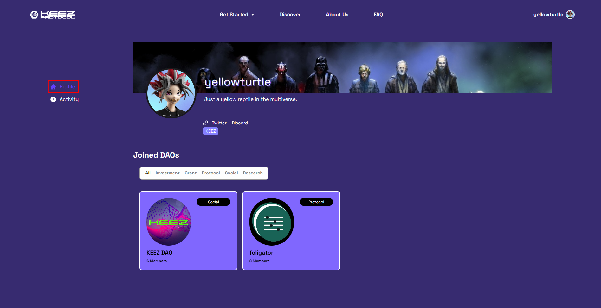
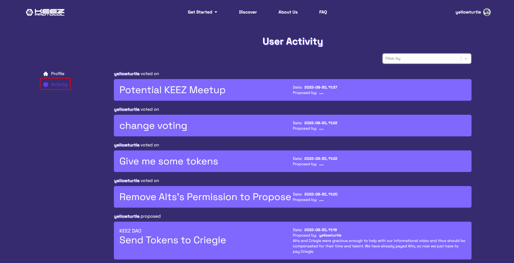

# Discover Users

## User Profiles Page

The user profile page pulls information from your Universal Profile. 

Here you can see the current DAOs you are a member of and use filters (similar to those on the Discover Page) to find the DAO in which you’d like to participate.

Individual activity is viewable in the activity tab of the sidebar. 

## User Activity

The Activity page displays all the proposals the member has voted on. 